# Murmur for Flutter

A reusable native Flutter indicator package and a working studio example
with seventeen shapes. Every indicator is drawn in Dart
with `CustomPainter`; no WebView, JavaScript, downloaded animations, or server
is involved. Microphone capture uses the `record` platform plugin.

## Gallery

### Voice indicators

Shown in the listening state, driven by the built-in demo signal.

<table>
  <tr>
    <td align="center">
      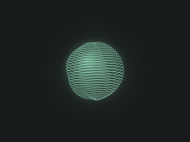<br>
      <b>Aurora orb</b><br>
      <sub>Organic · immersive</sub>
    </td>
    <td align="center">
      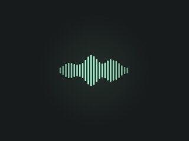<br>
      <b>Frequency bars</b><br>
      <sub>Rhythmic · precise</sub>
    </td>
    <td align="center">
      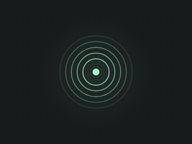<br>
      <b>Ripple rings</b><br>
      <sub>Calm · expansive</sub>
    </td>
  </tr>
  <tr>
    <td align="center">
      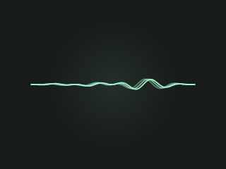<br>
      <b>Waveform</b><br>
      <sub>Familiar · expressive</sub>
    </td>
    <td align="center">
      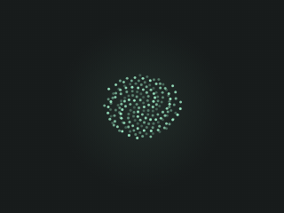<br>
      <b>Particle cloud</b><br>
      <sub>Playful · ambient</sub>
    </td>
    <td align="center">
      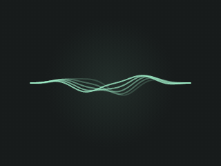<br>
      <b>Voice ribbon</b><br>
      <sub>Fluid · continuous</sub>
    </td>
  </tr>
  <tr>
    <td align="center">
      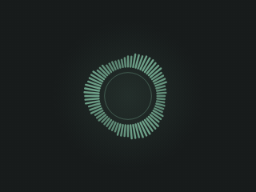<br>
      <b>Spectrum halo</b><br>
      <sub>Circular · detailed</sub>
    </td>
    <td align="center">
      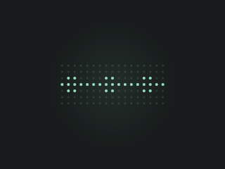<br>
      <b>Dot matrix</b><br>
      <sub>Digital · tactile</sub>
    </td>
    <td align="center">
      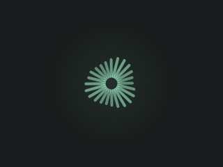<br>
      <b>Radial spokes</b><br>
      <sub>Bold · energetic</sub>
    </td>
  </tr>
  <tr>
    <td align="center">
      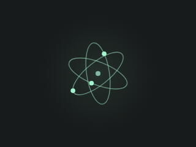<br>
      <b>Orbit trails</b><br>
      <sub>Spatial · flowing</sub>
    </td>
    <td align="center">
      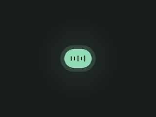<br>
      <b>Pulse capsule</b><br>
      <sub>Minimal · focused</sub>
    </td>
    <td align="center">
      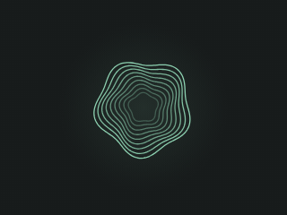<br>
      <b>Contour bloom</b><br>
      <sub>Layered · organic</sub>
    </td>
  </tr>
  <tr>
    <td align="center">
      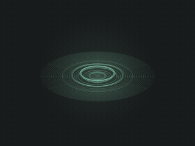<br>
      <b>Water surface</b><br>
      <sub>Rippling · luminous</sub>
    </td>
    <td align="center">
      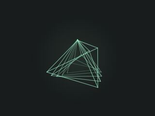<br>
      <b>Folded light</b><br>
      <sub>Angular · prismatic</sub>
    </td>
    <td align="center">
      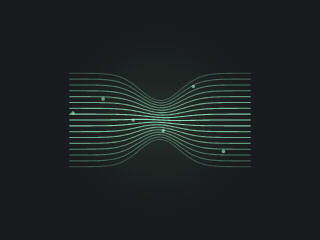<br>
      <b>Gravity well</b><br>
      <sub>Warped · magnetic</sub>
    </td>
  </tr>
  <tr>
    <td align="center">
      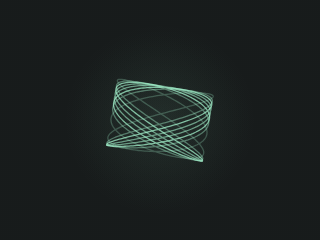<br>
      <b>Phase weave</b><br>
      <sub>Entangled · continuous</sub>
    </td>
    <td align="center">
      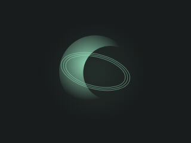<br>
      <b>Ink eclipse</b><br>
      <sub>Negative · atmospheric</sub>
    </td>
  </tr>
</table>

### Determinate loading

Progress eases from 0 to 100%.

<table>
  <tr>
    <td align="center">
      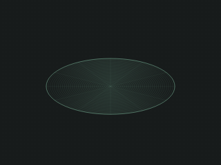<br>
      <b>Water surface</b><br>
      <sub>Fills from center to the rim</sub>
    </td>
    <td align="center">
      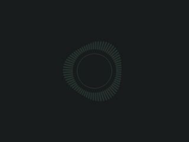<br>
      <b>Spectrum halo</b><br>
      <sub>Fills clockwise from the top</sub>
    </td>
    <td align="center">
      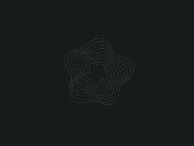<br>
      <b>Contour bloom</b><br>
      <sub>Fills from the innermost contour out</sub>
    </td>
  </tr>
</table>

To regenerate these after changing an indicator, run
`flutter test tool/render_gifs.dart` from the package root (needs ffmpeg).

## Start the studio

Install **Flutter 3.44 or newer with Dart 3.12 or newer**, and put `flutter`
and its bundled `dart` on your PATH. Have the normal toolchain for your chosen
platform installed (Xcode for iOS/macOS, Android Studio for Android, etc.).

Unzip the project, open a terminal in this folder, and run:

```sh
dart tool/bootstrap.dart
cd example
flutter run
```

The bootstrap script generates Android, iOS, macOS, Windows, Linux, and web
host projects from your installed Flutter SDK. It preserves the authored
Dart app and pubspec, adds microphone permissions, enables macOS audio input,
and sets Android's minimum SDK to 23. Existing host directories are preserved.
Platform scaffolding is generated rather than bundled so it matches your
installed SDK and host tools. This archive contains source, not a compiled app.

Use `flutter devices` to see available targets. For example:

```sh
flutter run -d macos
# or an Android/iOS device ID from flutter devices
```

The app starts in **Loading** mode on Contour bloom. Scrub the progress slider
from 0 to 100%, or play, pause, reset, and replay the sample loading sequence.
Switch to **Voice agent** for the simulated voice signal. Choose **Microphone** and grant
access to react to your voice, clapping, or music. Permission errors are shown
in the audio controls. Microphone capture stops when the app moves to the
background; returning resumes the demo and requires a deliberate mic restart.

On Linux, the capture plugin requires `parecord`, `pactl`, and `ffmpeg`
(typically `pulseaudio-utils` and `ffmpeg`). On web, microphone capture requires
localhost or HTTPS. Native builds use the OS microphone capture APIs.

## Included

- Seventeen shapes: Aurora orb, Frequency bars, Ripple rings, Waveform, Particle
  cloud, Voice ribbon, Spectrum halo, Dot matrix, Radial spokes, Orbit trails,
  Pulse capsule, Contour bloom, Water surface, Folded light, Gravity well,
  Phase weave, and Ink eclipse.
- Three determinate loading styles: Water surface, Spectrum halo, and Contour bloom.
- Idle, listening, thinking, and speaking states in Voice agent mode.
- Demo and microphone input, an input meter, pause, reset, and expanded preview.
- Accent presets and custom hex colors, scale, glow, sensitivity, and smoothing.
- A responsive studio with one shared animation clock for every preview.
- Reduced-motion awareness and semantic labels for the selected agent state.
- Mono PCM16 analysis with RMS volume, a Hann-window radix-2 FFT, 24 logarithmic
  frequency bands, and real waveform samples. Split samples across stream
  chunk boundaries are retained. DC offsets are removed. Stale audio fades out.

## New explorations

In Voice agent mode, **Water surface** shows a luminous surface mesh viewed at an
angle, with concentric ripples spreading outward. Sound level and transients
create new ripple pulses. Louder audio creates stronger waves; during silence,
existing ripples fade and the surface settles. Idle shows a still surface;
thinking emits gentle procedural ripples. There is no falling drop or splash.
The four abstract explorations follow it at the top of the gallery.

Four abstract alternatives are included:

- **Folded light**: rotating, nested prismatic wireframes that expand with sound.
- **Gravity well**: flowing parallel lines that pinch into a magnetic center.
- **Phase weave**: overlapping Lissajous paths that rotate and stretch with sound.
- **Ink eclipse**: a translucent crescent with a moving negative-space center.

Use the same colors, sensitivity, smoothing, and scale controls for all of them.

## Determinate loading widget

The reusable `LoadingIndicator` takes **normalized progress from 0.0 to 1.0**.
It has no audio dependency, ticker, timer, or animation controller. Updating
`progress` updates the exact visible state. Give it your real task progress,
such as completed bytes divided by total bytes, and rebuild when that changes.

```dart
import 'package:murmur/murmur.dart';

LoadingIndicator(
  progress: 0.42,
  shape: VoiceShape.contourBloom,
  style: const VoiceStyle(color: Color(0xFFA4F5CE), glow: true),
  size: const Size(320, 240),
)
```

Import `package:flutter/material.dart` for `Color` and `Size`. Supported shapes
are `VoiceShape.waterSurface`, `VoiceShape.spectrumHalo`, and
`VoiceShape.contourBloom`, also listed in `LoadingIndicator.supportedShapes`.

- **Water surface:** the illuminated area expands from center to a fixed rim.
- **Spectrum halo:** bars and an inner arc fill clockwise from the top.
- **Contour bloom:** nested organic contours fill from the innermost layer out.

All three have distinct empty, partial, and complete states, and semantic
percentage labels. Audio level and elapsed time do not determine progress.
The studio uses a separate eight-second animation controller solely to simulate
progress during preview; production callers supply their own real values.

## Reuse the voice widget

Add this package as a local dependency in your app's `pubspec.yaml`:

```yaml
dependencies:
  murmur:
    path: ../murmur
```

Create and dispose one controller in the screen that owns the indicators:

```dart
import 'package:flutter/material.dart';
import 'package:murmur/murmur.dart';

class AgentView extends StatefulWidget {
  const AgentView({super.key});
  @override
  State<AgentView> createState() => _AgentViewState();
}

class _AgentViewState extends State<AgentView>
    with SingleTickerProviderStateMixin {
  late final VoiceController voice;

  @override
  void initState() {
    super.initState();
    voice = VoiceController(vsync: this);
    // Starts in demo mode. See the external-audio example below.
  }

  @override
  Widget build(BuildContext context) => ColoredBox(
    color: const Color(0xFF171B1B),
    child: VoiceIndicator(
      controller: voice,
      shape: VoiceShape.spectrumHalo,
      size: const Size(320, 240),
    ),
  );

  @override
  void dispose() {
    voice.dispose();
    super.dispose();
  }
}
```

Change state and styling on the controller:

```dart
voice.state = AgentState.listening;
voice.style = voice.style.copyWith(
  color: const Color(0xFF92BAFF),
  sensitivity: 2.0,
  smoothing: 0.8,
  glow: true,
);
```

Use `VoiceIndicator.style` for a per-widget appearance override, and
`thumbnail: true` for inexpensive gallery previews. Share one controller among
multiple indicators; each painter listens to the controller without rebuilding
or laying out the surrounding UI on every animation tick. The input meter has
its own `ValueNotifier` updated at a lower rate.

### Feed your existing voice agent

Use the agent's existing audio stream rather than opening the mic a second time.
The widget does not perform speech recognition or generate an agent response.
Its states should be driven by your agent's lifecycle.

```dart
final analyzer = Pcm16Analyzer(sampleRate: 16000);
voice.useExternalAudio();
voice.state = AgentState.listening;

// pcmBytes must be mono, signed little-endian 16-bit PCM at this sample rate.
void onAgentAudioBytes(Uint8List pcmBytes) {
  for (final frame in analyzer.addBytes(pcmBytes)) {
    voice.addFrame(frame);
  }
}
```

Import `dart:typed_data` for `Uint8List`. Call `analyzer.reset()` when switching
between microphone and playback streams, or create an analyzer per stream.
Use `AgentState.speaking` and feed the agent's playback PCM to visualize output.
Compressed AAC/Opus bytes must be decoded first. Stereo must be downmixed first.
If your SDK already supplies normalized levels and frequency bands, bypass PCM:

```dart
voice.addFrame(AudioFrame(volume: 0.6, bands: bandLevels));
```

If you want standalone microphone input, use `MicrophoneInput(voice)` and await
`start()`, `stop()`, and `dispose()`. Configure permissions in the consuming app
as described below. Connect `onError` and `onEnded` to your UI. The reusable
controller must be suspended/resumed by the owning screen's visibility or app
lifecycle; the example demonstrates this. Dispose audio before its controller
when you can await cleanup.

### Microphone permissions in an existing app

- Android: add `android.permission.RECORD_AUDIO` in
  `android/app/src/main/AndroidManifest.xml`; minimum API 23.
- iOS/macOS: add `NSMicrophoneUsageDescription` in `Runner/Info.plist`.
- macOS: add `com.apple.security.device.audio-input` = `true` in both
  `DebugProfile.entitlements` and `Release.entitlements`.

The example's bootstrap handles these changes for you. Audio is processed
locally. Nothing in this package writes recordings or uploads audio.

## Check the project

From the package root:

```sh
flutter pub get
dart format lib example/lib test tool
flutter analyze
flutter test
dart tool/check_audio.dart
cd example
flutter pub get
flutter analyze
```

Tests cover sine-wave RMS and frequency response, arbitrary odd byte chunk
boundaries, silence, DC rejection, reset, invalid external signals, all seventeen
painters in every state at small and large sizes, stale-audio decay, and semantic
state changes. Loading widget tests cover all three shapes at 0/25/50/75/100%,
small and large sizes, and exact semantic percentage values. Also test microphone permission grant/deny, disconnect, background
and resume, custom colors, and switching sources on your physical target device.

### Validation in the creation environment

All Dart files passed a tree-sitter syntax parse. Package declarations, local
imports, shape coverage, and archive contents were also checked. A downloaded Dart runtime could report its
version but crashed during VM startup in this sandbox, and a Flutter SDK could
not be obtained here. Flutter analysis, widget tests, and native device microphone
checks have therefore **not been run**. The provided commands and tests are ready
to run with your local Flutter installation; the project should be validated on
your actual deployment targets before release.

## Source map

| File | Purpose |
| --- | --- |
| `lib/src/loading_indicator.dart` | Three standalone determinate Canvas renderers |
| `lib/src/indicator.dart` | Seventeen native Canvas renderers and semantic widget |
| `lib/src/controller.dart` | Shared ticker, demo, smoothing, state, signal decay |
| `lib/src/audio_analysis.dart` | Platform-independent PCM, RMS, FFT, waveform |
| `lib/src/microphone_input.dart` | Optional native microphone adapter |
| `lib/src/models.dart` | Shape/state enums and immutable style settings |
| `example/lib/main.dart` | Responsive studio and lifecycle handling |
| `tool/bootstrap.dart` | Host scaffolding and microphone permission setup |

API references: [Flutter CustomPainter](https://api.flutter.dev/flutter/rendering/CustomPainter-class.html),
[record package](https://pub.dev/packages/record),
[RecordConfig](https://pub.dev/documentation/record/latest/record/RecordConfig-class.html).
